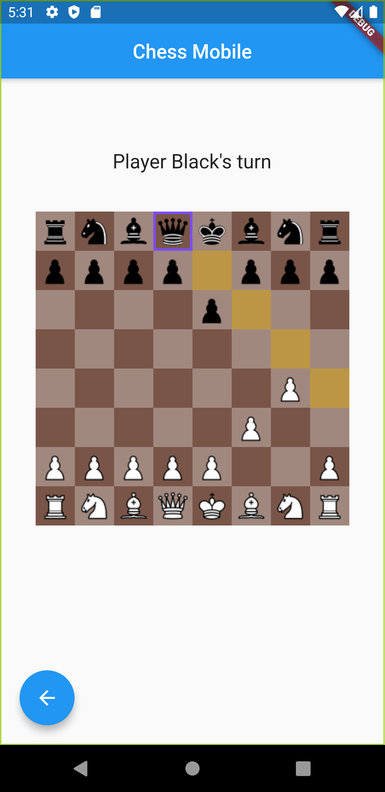
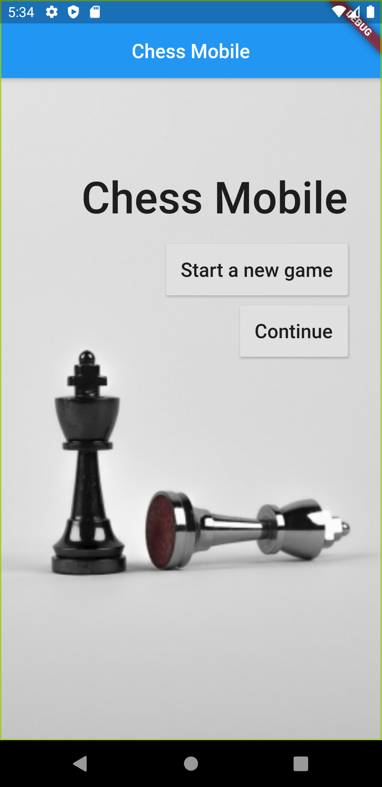
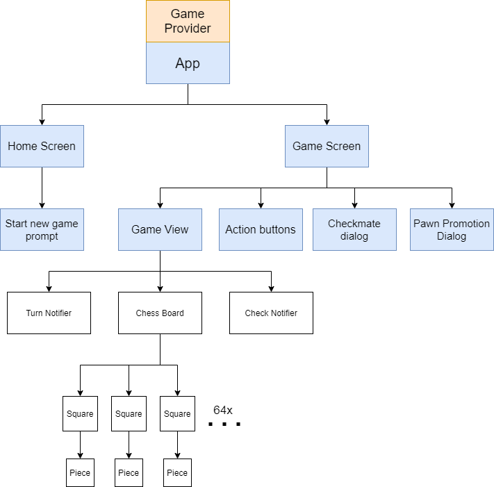
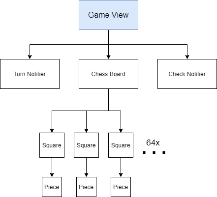

# Chess with Flutter

Welcome! This Flutter app is a simple chess game I created mainly to learn Flutter. Feel free to fork this repository or submit a pull request on this repository.

 

## v1.0.0

- Implement all of chess rules, including check, castling, en passant, and pawn promotion
- Add a functionality to start a new game and continue existing game
- Show "CHECK" message when player in turn is in check
- Show "Checkmate" dialog when checkmate happens

# App architecture

The app uses a single smart game engine (called GameProvider) and dumb, stateless widgets. In fact, every widget in the widget tree is stateless except for the PromotionDialog widget which takes user input on which piece to promote their pawn to.



The app only has two screens: Home and Game Screen. Inadvertently, the Game Screen widget tree is deeper and more complex.

All the widgets consume from Game Provider, which is the single source of truth. This allows the widgets to be stateless, which immensely simplifies the app architecture.

## Game View



The game view widget consists of:
* A Turn Notifier that shows whose turn it is
* A Check Notifier that displays message when the player in turn is in check
* The ChessBoard

The chessboard has 64 squares, which in turn has a nullable Piece child widget each. As mentioned above, these squares and pieces are stateless, meaning that their purpose is purely visual. They consume from the Game Provider, which contains data on where each piece should be.

I have also decided to go for "Select and Tap" mechanism, as opposed to "Drag and Drop". This decision is purely based on product design, so you're welcome to change it to Drag and Drop using Flutter's Draggable and Drag Target widget.

Learn more about Draggable [here](https://www.youtube.com/watch?v=QzA4c4QHZCY)

## Piece
Piece is an abstract Stateless Widget class, from which all pieces inherit from.

An instance of Piece has these immutable states:
```
  final Key key;
  final Player player;
  final PieceName pieceName;
```
these concrete methods:
- getCurrentPosition() returns the Square Number the piece is currently on
- pieceWillBeCaptured() returns true if opponent player taps on the piece and it is a valid move
- build(BuildContext context), overridden from Stateless Widget, that renders the piece sprite and listens to user tap input

and an abstract method `getAvailableMoves()`. This means that each derived class must override the method according to the chess rules.

This is a good use case of inheritance and the D.R.Y principle. Read more [here](https://en.wikipedia.org/wiki/Don%27t_repeat_yourself)

## Game Provider
As the single source of truth, the Provider contains all the game logic. These are the properties:
- `boardState`, which consists of a Map of all the squares and pieces, and a list of moves history
- `playerTurn` that stores data on whose turn it is
- `capturedPieces` that stores a list of all captured pieces
- `selectedPiece` that stores the currently selected piece
- `availableMoves` that stores the valid moves for the corresponding selected piece
- `isCheck` to determine whether playerTurn is in check

Every in-game action merely call the methods that change one or more of these properties. This has two main benefits:
1. Easier debugging => better development experience
2. Future development to make this game work on multiplayer mode will be easier, as the game data is already separated from the UI

# Future work
- Display captured pieces in game view
Right now, the Game Provider stores captured pieces data. This is not used in any way, and it could be useful to display captured pieces

- Undo button
Wouldn't it be nice if you can always undo a bad move? One might argue not, but I will implement this anyway

- Timed mode
Currently, the game is in Zen mode, i.e. no time limit. Having a timer will make the game more challenging and truly feel like an actual chess game

- Multi-device mode
As mentioned in the section above, the GameProvider contains all the necessary data to make the game run. Therefore, by storing the Provider data elsewhere for two (or even more) devices to access, the game can be played by two devices, both in real-time and in zen mode

- Player bot
- User login/register and ELO rating
- Audio

# Developer notes
The aim for this project is simply for me to learn Flutter, as well as a little bit of game development. Every time I have a desire to learn game development, I have been stunted by my lack of desire to do the graphics part (designing, etc.). If you're in the same situation, feel free to fork this repo and use my assets - I got them from Google anyway.

Lastly, if you'd like to collab and work on the future work, please don't hesitate to contact me at hizkiaadrians@gmail.com
